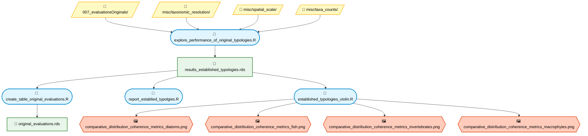

=== WORKFLOW 1: Established typologies ===

=== WORKFLOW 2: Simulation evaluation & coherence figures ===
```
flowchart TD

classDef script fill:#E1F5FE,stroke:#0288D1,stroke-width:2px,color:#000
classDef helper fill:#F3E5F5,stroke:#7B1FA2,stroke-width:2px,color:#000
classDef file fill:#E8F5E9,stroke:#388E3C,stroke-width:2px,color:#000
classDef folder fill:#FFF9C4,stroke:#FBC02D,stroke-width:2px,color:#000
classDef figure fill:#FFCCBC,stroke:#E64A19,stroke-width:2px,color:#000

%% Folders
D1[/"📁 007_evaluations/"/]:::folder
D2[/"📁 misc/taxonomic_resolution/"/]:::folder
D3[/"📁 misc/spatial_scale/"/]:::folder
D4[/"📁 misc/taxa_counts/"/]:::folder
D5[/"📁 misc/simulation_diagnostics/"/]:::folder

%% Scripts
S1(["📜 figure31_data.R"]):::script
S2(["📜 combine_evaluations.R"]):::script
S3(["📜 results_discrimination_data.R"]):::script
S4(["📜 summarize_results_simmulations.R"]):::script

%% Figure Scripts
SF1(["📜 figure_31.R"]):::script
SF2(["📜 31complement.R"]):::script
SF3(["📜 fuzzy_quality_type_coherence.R"]):::script
SF4(["📜 effect_of_quality_on_metrics.R"]):::script
SF5(["📜 fuzzy_internal_type_coherence.R"]):::script
SF6(["📜 results_discrimination.R"]):::script

%% Files
F1["📄 simulation_results_key_metrics.rds"]:::file
F2["📄 simulation_results_Nonkey_metrics.rds"]:::file
F3["📄 combined_data.rds"]:::file
F4["📄 results_discrimination.rds"]:::file
F5["📄 results_established_typologies.rds (external)"]:::file

%% Figures
G1{{"🖼️ comparative_distribution_coherence_metrics.png"}}:::figure
G2{{"🖼️ 31complement.png"}}:::figure
G3{{"🖼️ fuzzy_metric_vs_quality.tiff"}}:::figure
G4{{"🖼️ bland_altman_plot.png"}}:::figure
G5{{"🖼️ effect_of_quality_on_metrics.png"}}:::figure
G6{{"🖼️ fuzzy_internal_type_coherence1.tiff"}}:::figure
G7{{"🖼️ results_discrimination.png"}}:::figure

%% Edges
D1 --> S1
D1 --> S2
D1 --> S3
D2 --> S1
D2 --> S3
D3 --> S1
D3 --> S3
D4 --> S1
D4 --> S3
D5 --> S4

S1 --> F1
S1 --> F2
S2 --> F3
S3 --> F4

F1 --> SF1
F5 --> SF1
F5 --> SF2
F2 --> SF2

F3 --> SF3
F3 --> SF4
F3 --> SF5
F4 --> SF6

SF1 --> G1
SF2 --> G2
SF3 --> G3
SF3 --> G4
SF4 --> G5
SF5 --> G6
SF6 --> G7

```
=== WORKFLOW 3: HMSC & QRF (model-based analyses) ===
```
flowchart TD

classDef script fill:#E1F5FE,stroke:#0288D1,stroke-width:2px,color:#000
classDef helper fill:#F3E5F5,stroke:#7B1FA2,stroke-width:2px,color:#000
classDef file fill:#E8F5E9,stroke:#388E3C,stroke-width:2px,color:#000
classDef folder fill:#FFF9C4,stroke:#FBC02D,stroke-width:2px,color:#000
classDef figure fill:#FFCCBC,stroke:#E64A19,stroke-width:2px,color:#000

%% Folders
D1[/"📁 000_biota/*_scheme.rds/"/]:::folder
D2[/"📁 004_model_fit/"/]:::folder
D3[/"📁 004_model_fit_detail/"/]:::folder
D4[/"📁 005_variation_partitioning/"/]:::folder
D5[/"📁 007_evaluations/"/]:::folder
D6[/"📁 008_qrf/"/]:::folder
D7[/"📁 misc/taxonomic_resolution/"/]:::folder
D8[/"📁 misc/spatial_scale/"/]:::folder
D9[/"📁 misc/taxa_counts/"/]:::folder

%% Scripts
S1(["📜 explore_simulation_filter.R"]):::script
S2(["📜 species_specific_hmsc_results.R"]):::script
S3(["📜 evaluate_hmsc_model_performance.R"]):::script
S4(["📜 variationPartitioning_hmsc_data.R"]):::script
S5(["📜 variationPartitioning_hmsc_ternary_data.R"]):::script
S6(["📜 variableImportance_data.R"]):::script
S7(["📜 qrf_evaluation.R"]):::script
S8(["📜 species_specific_hmsc_tables.R"]):::script

%% Figure Scripts
SF1(["📜 variationPartitioning_hmsc.R"]):::script
SF2(["📜 variationPartitioning_hmsc_ternary.R"]):::script
SF3(["📜 variableImportance_hmsc.R"]):::script

%% Files
F1["📄 taxon_spec_hmsc_*.rds"]:::file
F2["📄 taxon_spec_hmsc_tables.rds"]:::file
F3["📄 variationPartitioning_hmsc.rds"]:::file
F4["📄 variationPartitioning_hmsc_ternary.rds"]:::file
F5["📄 variableImportance_hmsc.rds"]:::file
F6["📄 qrf_metrics.rds"]:::file
F7["📄 qrf_variable_importance.rds"]:::file
F8["📄 qrf_interval_coverage.rds"]:::file

%% Figures
G1{{"🖼️ variationPartitioning_hmsc.png"}}:::figure
G2{{"🖼️ ternartry1.tiff"}}:::figure
G3{{"🖼️ ternartry_diatoms.tiff"}}:::figure
G4{{"🖼️ ternartry_fish.tiff"}}:::figure
G5{{"🖼️ ternartry_invertebrates.tiff"}}:::figure
G6{{"🖼️ ternartry_macrophytes.tiff"}}:::figure
G7{{"🖼️ variableImportance_hmsc.png"}}:::figure

%% Edges
D1 --> S1
D1 --> S2
D2 --> S3
D3 --> S3
D4 --> S2
D4 --> S4
D4 --> S5
D4 --> S6
D4 --> S7
D5 --> S7
D6 --> S7
D7 --> S7
D8 --> S7
D9 --> S7

S2 --> F1
F1 --> S8
S8 --> F2
S4 --> F3
S5 --> F4
S6 --> F5
S7 --> F6
S7 --> F7
S7 --> F8

F3 --> SF1
F4 --> SF2
F5 --> SF3

SF1 --> G1
SF2 --> G2
SF2 --> G3
SF2 --> G4
SF2 --> G5
SF2 --> G6
SF3 --> G7

```
=== WORKFLOW 4: MIDIFIRE maps & filtering diagnostics ===
```
flowchart TD

classDef script fill:#E1F5FE,stroke:#0288D1,stroke-width:2px,color:#000
classDef helper fill:#F3E5F5,stroke:#7B1FA2,stroke-width:2px,color:#000
classDef file fill:#E8F5E9,stroke:#388E3C,stroke-width:2px,color:#000
classDef folder fill:#FFF9C4,stroke:#FBC02D,stroke-width:2px,color:#000
classDef figure fill:#FFCCBC,stroke:#E64A19,stroke-width:2px,color:#000

%% Folders
D1[/"📁 MIDIFIRE/"/]:::folder

%% Scripts
SF1(["📜 create_maps.R"]):::script
SF2(["📜 data_for_changes_incurred_through_filtering.R"]):::script

%% Figures
G1{{"🖼️ map_all.tiff"}}:::figure
G2{{"🖼️ map.tiff"}}:::figure
G3{{"🖼️ histogram_years.tiff"}}:::figure
G4{{"🖼️ fraction_years_kept.tiff"}}:::figure
G5{{"🖼️ histogram_month.tiff"}}:::figure
G6{{"🖼️ fraction_month_kept.tiff"}}:::figure

%% Edges
D1 --> SF1
D1 --> SF2

SF1 --> G1
SF2 --> G2
SF2 --> G3
SF2 --> G4
SF2 --> G5
SF2 --> G6
```