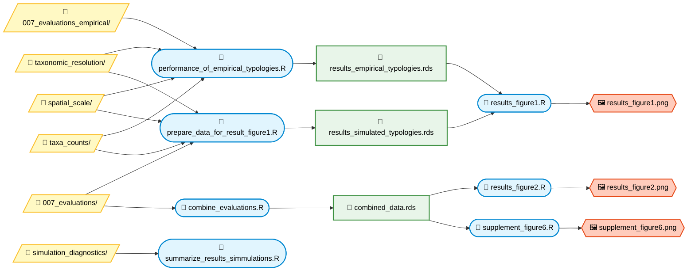
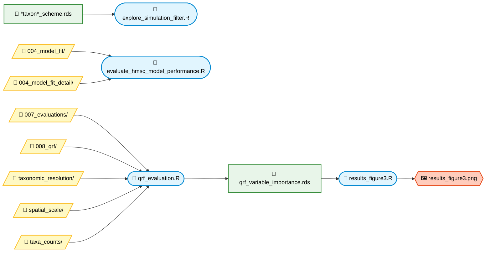
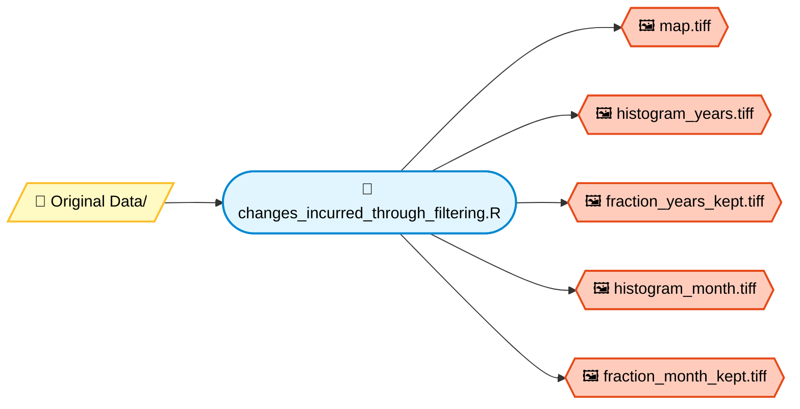

```mermaid
flowchart LR
classDef script fill:#E1F5FE,stroke:#0288D1,stroke-width:2px,color:#000
classDef helper fill:#F3E5F5,stroke:#7B1FA2,stroke-width:2px,color:#000
classDef file fill:#E8F5E9,stroke:#388E3C,stroke-width:2px,color:#000
classDef folder fill:#FFF9C4,stroke:#FBC02D,stroke-width:2px,color:#000
classDef figure fill:#FFCCBC,stroke:#E64A19,stroke-width:2px,color:#000

%% Folders
FD_EMP[/"📁 007_evaluations_empirical/"/]:::folder
FD_EVAL[/"📁 007_evaluations/"/]:::folder
FD_TAX[/"📁 taxonomic_resolution/"/]:::folder
FD_SPA[/"📁 spatial_scale/"/]:::folder
FD_CNT[/"📁 taxa_counts/"/]:::folder
FD_SIM[/"📁 simulation_diagnostics/"/]:::folder

%% Data-prep Scripts
S_PERF(["📜 performance_of_empirical_typologies.R"]):::script
S_PREP(["📜 prepare_data_for_result_figure1.R"]):::script
S_COMB(["📜 combine_evaluations.R"]):::script
S_SUMM(["📜 summarize_results_simmulations.R"]):::script

%% Figure Scripts
SF_FIG1(["📜 results_figure1.R"]):::script
SF_QTC(["📜 results_figure2.R"]):::script
SF_SF6(["📜 supplement_figure6.R"]):::script


%% Files
F_EMP["📄 results_empirical_typologies.rds"]:::file
F_SIM["📄 results_simulated_typologies.rds"]:::file
F_COMB["📄 combined_data.rds"]:::file


%% Figures
G_CDC{{"🖼️ results_figure1.png"}}:::figure
G_BA{{"🖼️ results_figure2.png"}}:::figure
G_SF6{{"🖼️ supplement_figure6.png"}}:::figure

%% Folder -> Script edges
FD_EMP --> S_PERF
FD_TAX --> S_PERF
FD_SPA --> S_PERF
FD_CNT --> S_PERF
FD_EVAL --> S_PREP
FD_EVAL --> S_COMB
FD_TAX --> S_PREP
FD_SPA --> S_PREP
FD_CNT --> S_PREP
FD_SIM --> S_SUMM

%% Script -> File edges
S_PERF --> F_EMP
S_PREP --> F_SIM
S_COMB --> F_COMB


%% File -> Figure-script edges
F_EMP --> SF_FIG1
F_SIM --> SF_FIG1
F_COMB --> SF_QTC
F_COMB --> SF_SF6

%% Figure-script -> Figure edges
SF_FIG1 --> G_CDC
SF_QTC --> G_BA
SF_SF6 --> G_SF6
```

``` mermaid
flowchart LR

classDef script fill:#E1F5FE,stroke:#0288D1,stroke-width:2px,color:#000
classDef helper fill:#F3E5F5,stroke:#7B1FA2,stroke-width:2px,color:#000
classDef file fill:#E8F5E9,stroke:#388E3C,stroke-width:2px,color:#000
classDef folder fill:#FFF9C4,stroke:#FBC02D,stroke-width:2px,color:#000
classDef figure fill:#FFCCBC,stroke:#E64A19,stroke-width:2px,color:#000

%% Folders
D2[/"📁 004_model_fit/"/]:::folder
D3[/"📁 004_model_fit_detail/"/]:::folder
D5[/"📁 007_evaluations/"/]:::folder
D6[/"📁 008_qrf/"/]:::folder
D7[/"📁 taxonomic_resolution/"/]:::folder
D8[/"📁 spatial_scale/"/]:::folder
D9[/"📁 taxa_counts/"/]:::folder

%% Scripts
S1(["📜 explore_simulation_filter.R"]):::script
S3(["📜 evaluate_hmsc_model_performance.R"]):::script
S7(["📜 qrf_evaluation.R"]):::script

%% Figure Scripts
SF2(["📜 results_figure3.R"]):::script

%% Files
F7["📄 qrf_variable_importance.rds"]:::file
F9["📄 *taxon*_scheme.rds"]:::file

%% Figures
G2{{"🖼️ results_figure3.png"}}:::figure

%% Edges
F9 --> S1

D2 --> S3
D3 --> S3


D5 --> S7
D6 --> S7
D7 --> S7
D8 --> S7
D9 --> S7


S7 --> F7


F7 --> SF2

SF2 --> G2
``` 

``` mermaid
flowchart LR

classDef script fill:#E1F5FE,stroke:#0288D1,stroke-width:2px,color:#000
classDef helper fill:#F3E5F5,stroke:#7B1FA2,stroke-width:2px,color:#000
classDef file fill:#E8F5E9,stroke:#388E3C,stroke-width:2px,color:#000
classDef folder fill:#FFF9C4,stroke:#FBC02D,stroke-width:2px,color:#000
classDef figure fill:#FFCCBC,stroke:#E64A19,stroke-width:2px,color:#000

%% Folders
D1[/"📁 Original Data/"/]:::folder

%% Scripts
SF2(["📜 changes_incurred_through_filtering.R"]):::script

%% Figures
G2{{"🖼️ map.tiff"}}:::figure
G3{{"🖼️ histogram_years.tiff"}}:::figure
G4{{"🖼️ fraction_years_kept.tiff"}}:::figure
G5{{"🖼️ histogram_month.tiff"}}:::figure
G6{{"🖼️ fraction_month_kept.tiff"}}:::figure

%% Edges
D1 --> SF2

SF2 --> G2
SF2 --> G3
SF2 --> G4
SF2 --> G5
SF2 --> G6
```
