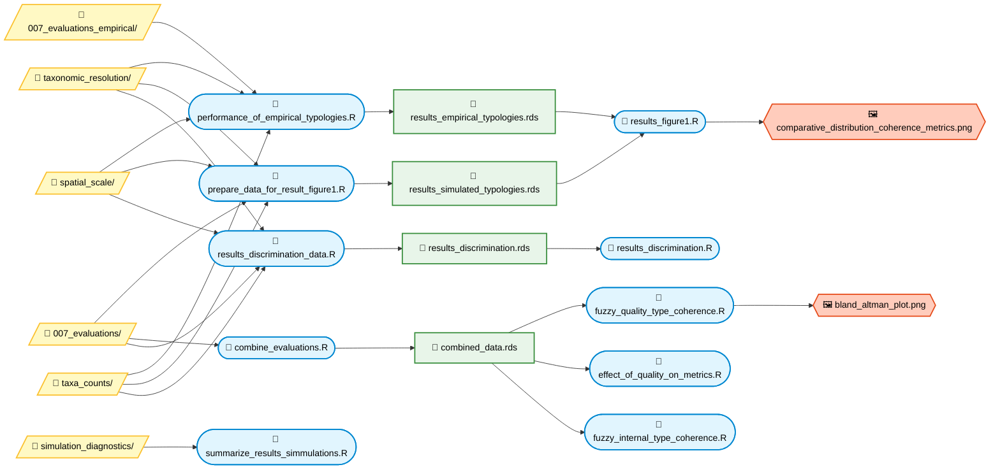
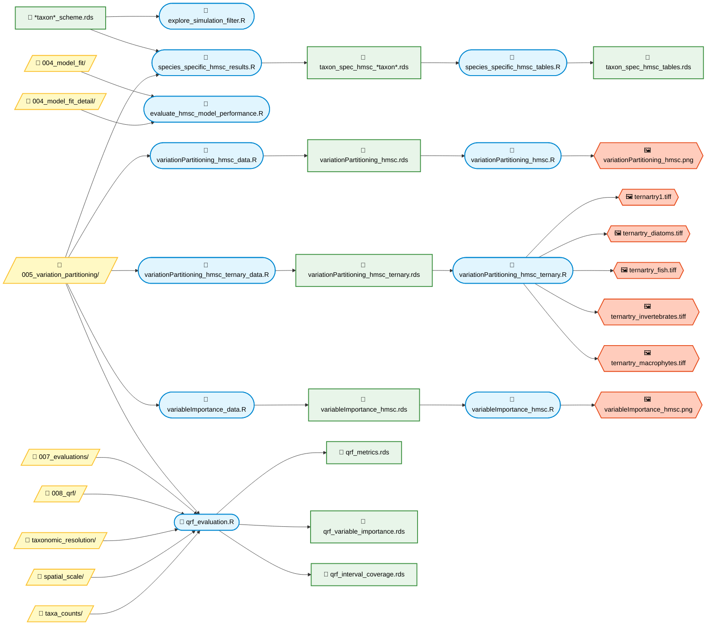
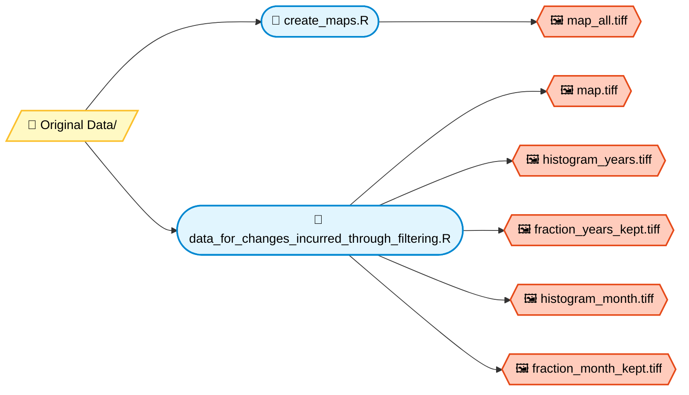

=== WORKFLOW 1: Empirical typologies ===

```mermaid
flowchart LR
classDef script fill:#E1F5FE,stroke:#0288D1,stroke-width:2px,color:#000
classDef helper fill:#F3E5F5,stroke:#7B1FA2,stroke-width:2px,color:#000
classDef file fill:#E8F5E9,stroke:#388E3C,stroke-width:2px,color:#000
classDef folder fill:#FFF9C4,stroke:#FBC02D,stroke-width:2px,color:#000
classDef figure fill:#FFCCBC,stroke:#E64A19,stroke-width:2px,color:#000

%% Folders
FD_EMP[/"📁 007_evaluations_empirical/"/]:::folder
FD_EVAL[/"📁 007_evaluations/"/]:::folder
FD_TAX[/"📁 taxonomic_resolution/"/]:::folder
FD_SPA[/"📁 spatial_scale/"/]:::folder
FD_CNT[/"📁 taxa_counts/"/]:::folder
FD_SIM[/"📁 simulation_diagnostics/"/]:::folder

%% Data-prep Scripts
S_PERF(["📜 performance_of_empirical_typologies.R"]):::script
S_PREP(["📜 prepare_data_for_result_figure1.R"]):::script
S_COMB(["📜 combine_evaluations.R"]):::script
S_DISC(["📜 results_discrimination_data.R"]):::script
S_SUMM(["📜 summarize_results_simmulations.R"]):::script

%% Figure Scripts
SF_FIG1(["📜 results_figure1.R"]):::script
SF_QTC(["📜 fuzzy_quality_type_coherence.R"]):::script
SF_EQM(["📜 effect_of_quality_on_metrics.R"]):::script
SF_ITC(["📜 fuzzy_internal_type_coherence.R"]):::script
SF_DISC(["📜 results_discrimination.R"]):::script

%% Files
F_EMP["📄 results_empirical_typologies.rds"]:::file
F_SIM["📄 results_simulated_typologies.rds"]:::file
F_COMB["📄 combined_data.rds"]:::file
F_DISC["📄 results_discrimination.rds"]:::file

%% Figures
G_CDC{{"🖼️ comparative_distribution_coherence_metrics.png"}}:::figure
G_BA{{"🖼️ bland_altman_plot.png"}}:::figure

%% Folder -> Script edges
FD_EMP --> S_PERF
FD_TAX --> S_PERF
FD_SPA --> S_PERF
FD_CNT --> S_PERF

FD_EVAL --> S_PREP
FD_EVAL --> S_COMB
FD_EVAL --> S_DISC
FD_TAX --> S_PREP
FD_TAX --> S_DISC
FD_SPA --> S_PREP
FD_SPA --> S_DISC
FD_CNT --> S_PREP
FD_CNT --> S_DISC
FD_SIM --> S_SUMM

%% Script -> File edges
S_PERF --> F_EMP
S_PREP --> F_SIM
S_COMB --> F_COMB
S_DISC --> F_DISC

%% File -> Figure-script edges
F_EMP --> SF_FIG1
F_SIM --> SF_FIG1
F_COMB --> SF_QTC
F_COMB --> SF_EQM
F_COMB --> SF_ITC
F_DISC --> SF_DISC

%% Figure-script -> Figure edges
SF_FIG1 --> G_CDC
SF_QTC --> G_BA
```
=== WORKFLOW 3: HMSC & QRF (model-based analyses) ===

``` mermaid
flowchart LR

classDef script fill:#E1F5FE,stroke:#0288D1,stroke-width:2px,color:#000
classDef helper fill:#F3E5F5,stroke:#7B1FA2,stroke-width:2px,color:#000
classDef file fill:#E8F5E9,stroke:#388E3C,stroke-width:2px,color:#000
classDef folder fill:#FFF9C4,stroke:#FBC02D,stroke-width:2px,color:#000
classDef figure fill:#FFCCBC,stroke:#E64A19,stroke-width:2px,color:#000


%% Folders
D2[/"📁 004_model_fit/"/]:::folder
D3[/"📁 004_model_fit_detail/"/]:::folder
D4[/"📁 005_variation_partitioning/"/]:::folder
D5[/"📁 007_evaluations/"/]:::folder
D6[/"📁 008_qrf/"/]:::folder
D7[/"📁 taxonomic_resolution/"/]:::folder
D8[/"📁 spatial_scale/"/]:::folder
D9[/"📁 taxa_counts/"/]:::folder

%% Scripts
S1(["📜 explore_simulation_filter.R"]):::script
S2(["📜 species_specific_hmsc_results.R"]):::script
S3(["📜 evaluate_hmsc_model_performance.R"]):::script
S4(["📜 variationPartitioning_hmsc_data.R"]):::script
S5(["📜 variationPartitioning_hmsc_ternary_data.R"]):::script
S6(["📜 variableImportance_data.R"]):::script
S7(["📜 qrf_evaluation.R"]):::script
S8(["📜 species_specific_hmsc_tables.R"]):::script

%% Figure Scripts
SF1(["📜 variationPartitioning_hmsc.R"]):::script
SF2(["📜 variationPartitioning_hmsc_ternary.R"]):::script
SF3(["📜 variableImportance_hmsc.R"]):::script

%% Files
F1["📄 taxon_spec_hmsc_*taxon*.rds"]:::file
F2["📄 taxon_spec_hmsc_tables.rds"]:::file
F3["📄 variationPartitioning_hmsc.rds"]:::file
F4["📄 variationPartitioning_hmsc_ternary.rds"]:::file
F5["📄 variableImportance_hmsc.rds"]:::file
F6["📄 qrf_metrics.rds"]:::file
F7["📄 qrf_variable_importance.rds"]:::file
F8["📄 qrf_interval_coverage.rds"]:::file
F9["📄 *taxon*_scheme.rds"]:::file

%% Figures
G1{{"🖼️ variationPartitioning_hmsc.png"}}:::figure
G2{{"🖼️ ternartry1.tiff"}}:::figure
G3{{"🖼️ ternartry_diatoms.tiff"}}:::figure
G4{{"🖼️ ternartry_fish.tiff"}}:::figure
G5{{"🖼️ ternartry_invertebrates.tiff"}}:::figure
G6{{"🖼️ ternartry_macrophytes.tiff"}}:::figure
G7{{"🖼️ variableImportance_hmsc.png"}}:::figure

%% Edges
F9 --> S1
F9 --> S2
D2 --> S3
D3 --> S3
D4 --> S2
D4 --> S4
D4 --> S5
D4 --> S6
D4 --> S7
D5 --> S7
D6 --> S7
D7 --> S7
D8 --> S7
D9 --> S7

S2 --> F1
F1 --> S8
S8 --> F2
S4 --> F3
S5 --> F4
S6 --> F5
S7 --> F6
S7 --> F7
S7 --> F8

F3 --> SF1
F4 --> SF2
F5 --> SF3

SF1 --> G1
SF2 --> G2
SF2 --> G3
SF2 --> G4
SF2 --> G5
SF2 --> G6
SF3 --> G7
``` 
=== WORKFLOW 4: Maps & filtering diagnostics ===

``` mermaid
flowchart LR

classDef script fill:#E1F5FE,stroke:#0288D1,stroke-width:2px,color:#000
classDef helper fill:#F3E5F5,stroke:#7B1FA2,stroke-width:2px,color:#000
classDef file fill:#E8F5E9,stroke:#388E3C,stroke-width:2px,color:#000
classDef folder fill:#FFF9C4,stroke:#FBC02D,stroke-width:2px,color:#000
classDef figure fill:#FFCCBC,stroke:#E64A19,stroke-width:2px,color:#000

%% Folders
D1[/"📁 Original Data/"/]:::folder

%% Scripts
SF1(["📜 create_maps.R"]):::script
SF2(["📜 data_for_changes_incurred_through_filtering.R"]):::script

%% Figures
G1{{"🖼️ map_all.tiff"}}:::figure
G2{{"🖼️ map.tiff"}}:::figure
G3{{"🖼️ histogram_years.tiff"}}:::figure
G4{{"🖼️ fraction_years_kept.tiff"}}:::figure
G5{{"🖼️ histogram_month.tiff"}}:::figure
G6{{"🖼️ fraction_month_kept.tiff"}}:::figure

%% Edges
D1 --> SF1
D1 --> SF2

SF1 --> G1
SF2 --> G2
SF2 --> G3
SF2 --> G4
SF2 --> G5
SF2 --> G6
```
